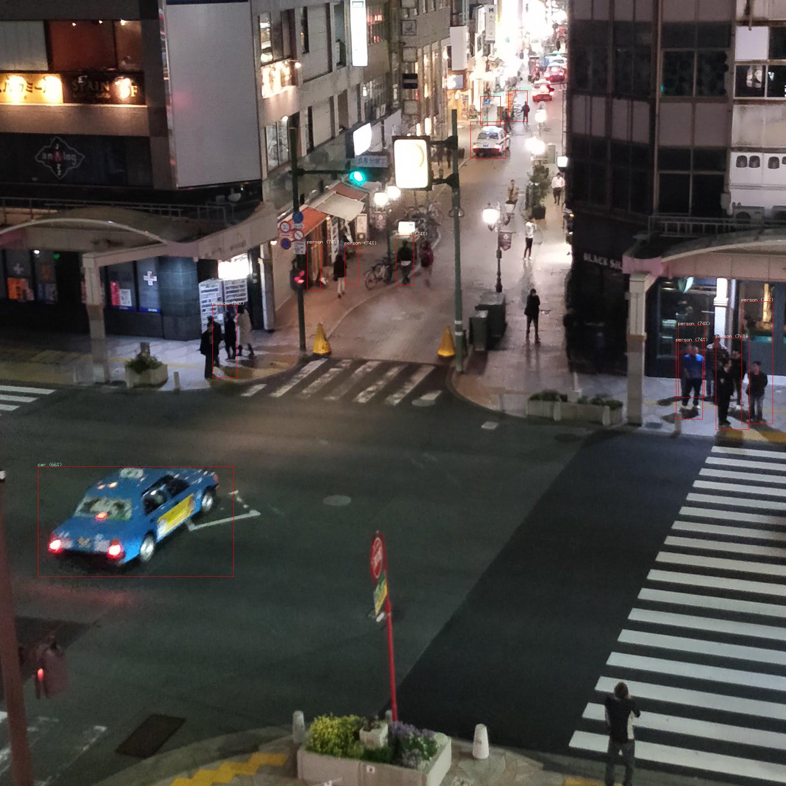

# go-object-detection
golangでtensorflowを使ってみた．

[(この記事)](https://mattn.kaoriya.net/software/lang/go/20180825013735.htm)で実装されたものをローカルで動くように少し改変しただけ．

## result

## credit
* https://github.com/mattn/go-object-detect-from-image
